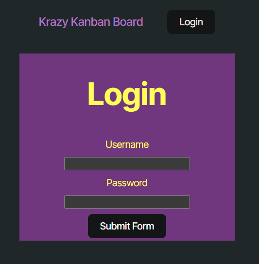
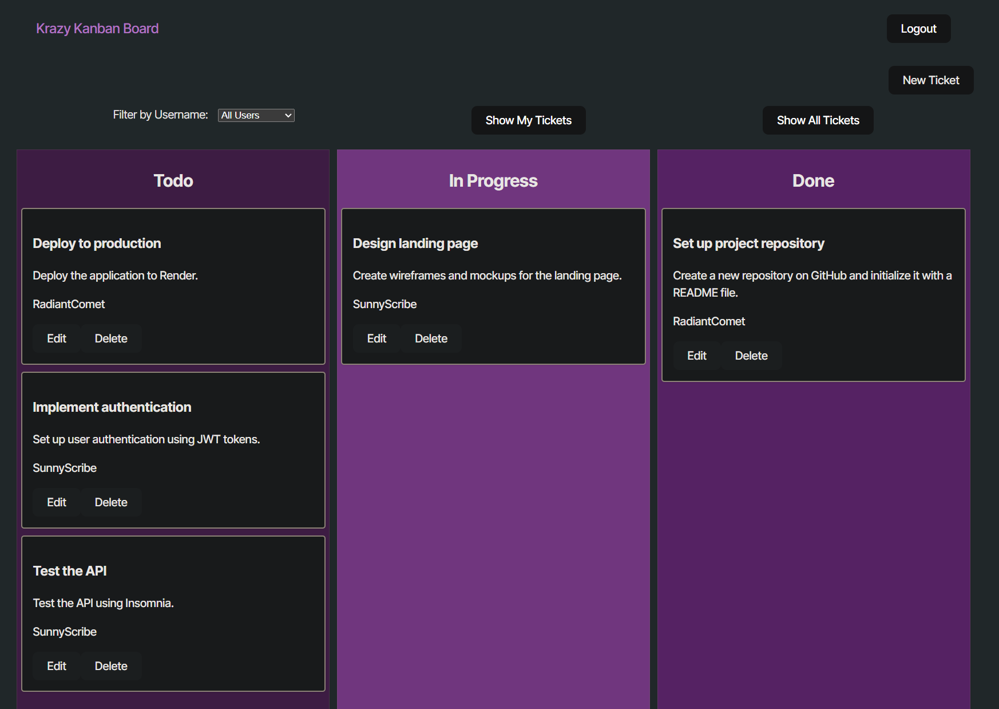

# Personal-Kanban

A NodeJS Kanban Board application that utilizes JWTs. You can find the deployed application on [Render](https://personal-kanban.onrender.com/)!

## Usage

- Login: Use one of the example users to log in.
- Create Ticket: After logging in, you can create new tickets by clicking on the "New Ticket" button.
- Edit Ticket: You can edit existing tickets by clicking on the "Edit" button on a ticket card.
- Delete Ticket: You can delete a ticket by clicking on the "Delete" button on a ticket card.
- Filter Tickets: Use the filter options to view tickets assigned to specific users.

### Example Users

You can use the following example users to log in:

| Username      | Password  |
|---------------|-----------|
| JollyGuru     | password  |
| SunnyScribe   | password  |
| RadiantComet  | password  |

## Screenshots

## License

This project is licensed under the GPL 3.0 License - see the [LICENSE](LICENSE) file for details.